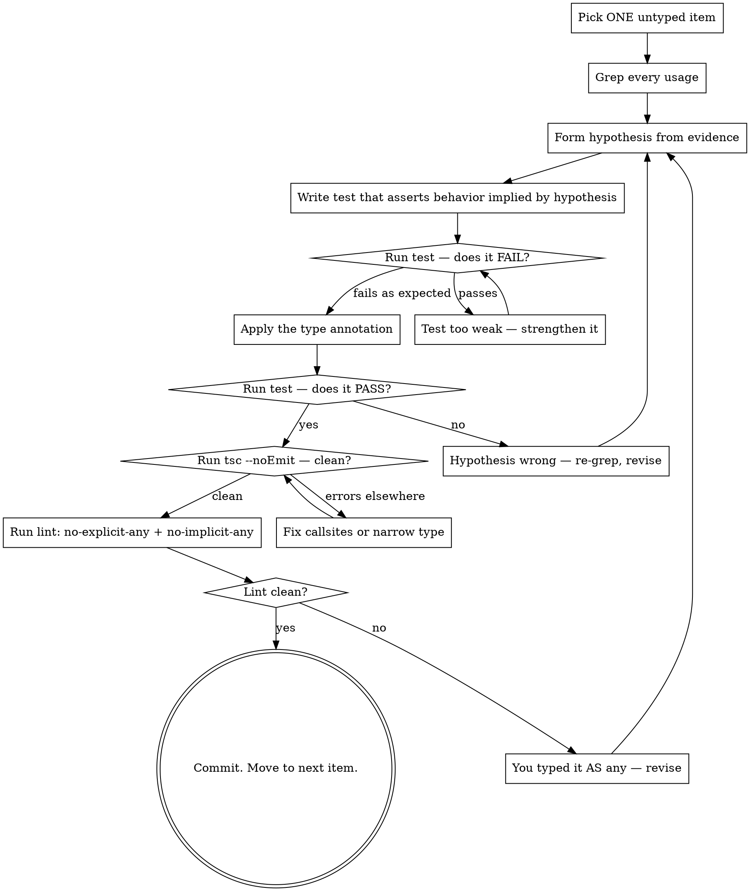

# Type Mania

## Overview

**Type each item like a controlled experiment.** Pick ONE untyped thing. Read every place it's used. Write a test **that fails while the item is still `any`**. Add the type. Watch it pass.

Core principle: **the test must fail against `any`.** If a test passes when the item's type is `any` (or untyped, which is the same thing), the test proves nothing — `any` accepts every input and returns every output, so behavioral assertions slide right through it. The only tests that have teeth are ones `any` cannot satisfy.

This is the opposite of "annotate the file in one pass." It is slow on purpose. Each type is small, evidenced, and verified.

## When to Use

Use when:
- Migrating from JS → TS, or removing `any` / `unknown` from a real codebase
- An untyped parameter, return, variable, or export needs a precise type
- You're tempted to write `as any` or `// @ts-ignore` — STOP and apply this skill instead
- Type inference is producing a wider type than the code actually accepts/returns
- A function "works" but you can't tell what it actually expects

Do NOT use when:
- You're greenfield-writing a new function (just type it as you write — TDD applies, but not this loop)
- The codebase has no test runner or no type checker (fix that first)
- A type is mechanically derivable (e.g., codegen, schema → type) — automate instead

## The Iron Loop

```
ONE ITEM. ONE TEST. ONE TYPE.
```

You may not type item B until item A has gone full RED → GREEN. No batching. No "I'll fix the rest while I'm here."

If you find yourself typing two things at once — stop, revert the second one, finish the first.

## RED-GREEN-REFACTOR (per item)



## The Six Steps

### 1. Pick ONE untyped item

Pick the smallest thing you can type in isolation. Order of preference:

1. **Leaves first**: pure functions with no dependencies, constants, simple variables
2. **Then params**: function parameters used by already-typed code
3. **Then returns**: function return types
4. **Then exports**: public API surface
5. **Last**: deeply-connected internal state, generics, conditional types

Don't pick a 200-line function with 12 untyped params. Pick one param. The other eleven wait their turn.

### 2. Grep every usage

You are now an archaeologist. Before forming any hypothesis, gather evidence:

```bash
# Find every callsite / reference
rg -n 'functionName\(' --type ts
rg -n '\.propertyName\b' --type ts
rg -n 'import.*\bfoo\b' --type ts

# For a parameter, find the function then find its callers
rg -n 'export function foo' --type ts
rg -n 'foo\s*\(' --type ts
```

Read the **callsites**, not just the function body. The callsites tell you what is *actually* passed in. The function body only tells you what the author *handles*.

For each usage, write down (literally — in a scratch file or just notes):
- What is being passed in?
- What is being done with the return value?
- Is it being narrowed (`if (x) ...`)? Spread? Indexed? Awaited?

### 3. Form a hypothesis from evidence

Synthesize what you saw. Be specific:

> ❌ Weak: "It's probably a string."
>
> ✅ Strong: "Across 7 callsites it receives a non-empty string that's always a UUID format. Inside the function it's only `.slice()`-d and compared with `===`. So `string` is sufficient — narrower (`UUID` brand) is overkill until proven."

If callsites disagree (one passes `string`, one passes `string | null`) — your hypothesis must cover both. That's a `string | null` (or you fix the caller, which is a different RED-GREEN loop).

### 4. Write a test that fails against `any`

**This is the heart of the skill.** The test must distinguish the hypothesized type from `any`. If the test passes while the item is still untyped (i.e. has type `any`), the test has no teeth — `any` is the universal subtype/supertype, so any assertion that compiles also compiles against `any`.

The Litmus Test for a Good Test:

> Mentally annotate the item as `any`. Does the test still pass?
>  - **Yes** → test is too weak. Throw it out and try again.
>  - **No** → test has teeth. Proceed.

There are three test flavors. **Only the type-level and negative ones reliably fail against `any`.** Behavioral tests usually do NOT — that's why they alone are insufficient.

**Behavioral test** — asserts runtime behavior. Useful, but weak alone:

```ts
test("parseId trims and returns the string", () => {
  expect(parseId("  abc ")).toBe("abc");
});
// ⚠️ This passes whether parseId's signature is (x: string) => string
// OR (x: any) => any. It does NOT distinguish the two. Insufficient by itself.
```

**Type-level test** — asserts at compile time what the type IS. Fails against `any`:

```ts
import { expectTypeOf } from "expect-type";

expectTypeOf(parseId).parameter(0).toEqualTypeOf<string>();
expectTypeOf(parseId).returns.toEqualTypeOf<string>();
// ✅ Against `(x: any) => any`, expectTypeOf<any>().toEqualTypeOf<string>() FAILS.
// This test has teeth.
```

**Negative test** (`@ts-expect-error`) — asserts the type REJECTS bad inputs. Fails against `any`:

```ts
// @ts-expect-error — undefined is not assignable to string
parseId(undefined);

// @ts-expect-error — number is not a valid id
parseId(42);
// ✅ If the param were `any`, both lines would compile cleanly,
// which means the @ts-expect-error directive itself becomes an error
// ("unused expect-error"). The test FAILS. Exactly what we want.
```

**The rule:** every typed item gets at least one **type-level** or **negative** test. Behavioral tests are bonus, not substitute.

**Run the test suite + type checker NOW, before adding the annotation.**

```bash
npx vitest run path/to/test.ts   # type-level lib assertions
npx tsc --noEmit                 # @ts-expect-error directives
```

It MUST fail. If it passes against the still-untyped code, your test cannot tell `any` from the real type — strengthen it before continuing.

### 5. Apply the type annotation — minimum viable

Add ONLY the annotation needed for this item. Resist the urge to also annotate three nearby things.

```ts
// Before
export function parseId(input) {
  return input.trim();
}

// After — minimal change
export function parseId(input: string): string {
  return input.trim();
}
```

### 6. Run the test. Run the type checker. Run the lint gate. Confirm.

```bash
npx vitest run path/to/test.ts
npx tsc --noEmit
# Lint gate — no new `any`, no implicit `any`
npx eslint <file> --rule '@typescript-eslint/no-explicit-any:error' \
                  --rule '@typescript-eslint/no-implicit-any-catch:error'
# OR for this repo (oxlint):
bun run lint
```

The lint gate is non-negotiable. If you typed an item and the file now contains `any` or an implicit-any binding (param, catch, callback), **you didn't finish the loop** — you smuggled `any` in to make the test pass. Go back to step 3 and revise the hypothesis.

Project-level safety net: ensure `tsconfig.json` has `"noImplicitAny": true` (or `"strict": true`). Without it, untyped params silently become `any` and the lint rule alone won't catch them at the type-checker layer. Turn it on once and every future loop benefits.

Four outcomes:

| Test | tsc | Lint (no-any) | Meaning |
|------|-----|---------------|---------|
| ✅ Pass | ✅ Clean | ✅ Clean | Done. Commit. Next item. |
| ✅ Pass | ✅ Clean | ❌ `any` found | You typed it AS `any` (or left an implicit one). Loop incomplete — revise. |
| ✅ Pass | ❌ Errors | — | Type is right but propagated errors elsewhere. Either fix those callsites (each its own RED-GREEN) or your hypothesis is too narrow. |
| ❌ Fail | — | — | Hypothesis wrong. Back to step 2 with new evidence. Don't widen the type to make the test pass — that's just adding `any` with extra steps. |

## Quick Reference

| Untyped form | First check | Test shape |
|--------------|-------------|------------|
| `function f(x) {...}` | callsites of `f` | type-level + behavior |
| `const x = JSON.parse(...)` | what `x.foo` accesses | runtime parse + type assertion |
| `(payload: any) => ...` | callers of this fn | type-level negative test (`@ts-expect-error` for wrong shapes) |
| `// @ts-ignore` line | the line below it | remove ignore, write test that proves the code now passes the checker |
| Implicit any in callback | the API that calls the callback | type-level on callback signature |
| Untyped export from JS module | every importer | per-importer behavior tests + type-level |

## Common Mistakes

| Mistake | Why it's wrong | Fix |
|---------|---------------|-----|
| **Behavioral test only, no type-level test** | **Behavioral assertions pass against `any` — the test has no teeth** | **Add `expectTypeOf` or `@ts-expect-error` so the test fails when the item is `any`** |
| Annotating before grepping | You're guessing from one usage | Grep ALL usages first |
| Skipping the failing-test step | Tests that pass first prove nothing | Always RED before GREEN |
| `as any` to silence cascade errors | You hid the bug, didn't type the item | Treat each cascade error as its own RED-GREEN |
| Typing five items in one commit | You can't tell which type was wrong when CI fails | One item per commit |
| Trusting IDE hover / inference | Inference = `any` propagation in untyped codebases | Evidence comes from grep, not hover |
| Widening the type to make tests pass | You just deleted the type's value | Re-examine hypothesis; the callsite is wrong, OR your test is wrong |
| "I'll fix the callsites later" | Later = never | Fix them now, each as its own loop |
| Picking the biggest function first | You'll drown in cascade errors | Leaves first, then upward |

## Red Flags — STOP

You're rationalizing away the discipline if you think:

- "This one's obvious, no test needed" → write the test
- "The IDE already shows the type" → IDE shows inference, not truth
- "I'll batch these similar ones" → no, one at a time
- "Let me just `as any` this and come back" → you won't come back
- "The test is too tedious to write" → that's the skill working — it's supposed to be small and slow
- "Inference handles it" → inference in an untyped neighborhood is `any` in disguise
- "I'll widen the type so the test passes" → you killed the experiment

All of these mean: stop, pick one item, grep, hypothesize, RED, GREEN. No shortcuts.

## Why Precision and Minutia

This skill is about **small, systematic, evidenced** moves. Big sweeping type passes feel productive but produce types that match nothing in particular — they're shaped like the file, not shaped like reality. One-item-at-a-time loops produce types that are *load-bearing*: each one was proven necessary by a test that would fail without it.

The discipline scales: 200 small loops > one heroic refactor that nobody can review.

## End-of-Session Check

Before stopping work:

- [ ] Every typed item has at least one test that would fail if the type were widened to `any`
- [ ] `npx tsc --noEmit` is clean
- [ ] Lint gate clean: `no-explicit-any` and `no-implicit-any-catch` rules pass on every touched file (or `bun run lint` if the project uses oxlint/biome — confirm those rules are enabled)
- [ ] `tsconfig.json` has `noImplicitAny: true` (or `strict: true`) — if not, fix that first; without it the lint rule misses implicit anys
- [ ] Each commit types exactly one item (or one tightly-coupled cluster justified in the message)
- [ ] No new `as any`, `// @ts-ignore`, `// @ts-expect-error` *without justification* introduced
- [ ] If the loop ever skipped — note which item, so you can come back and do it properly
